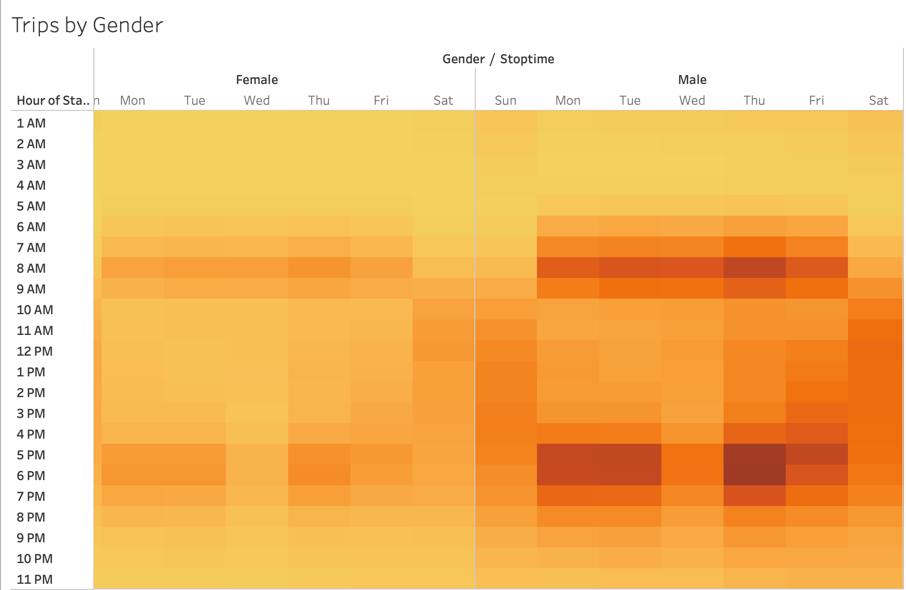
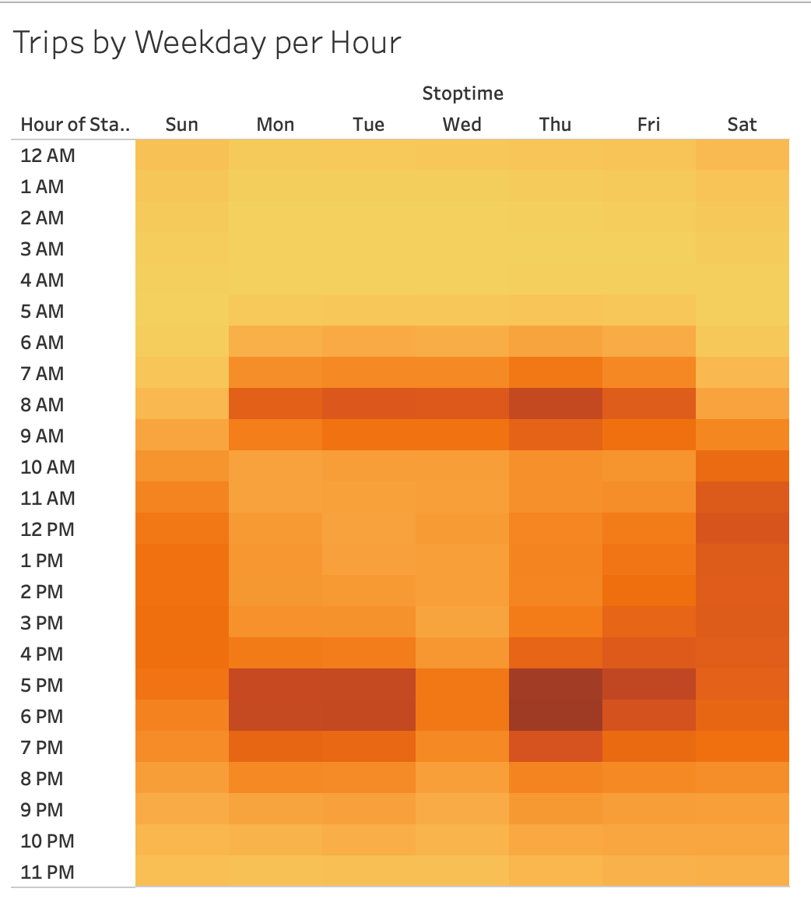
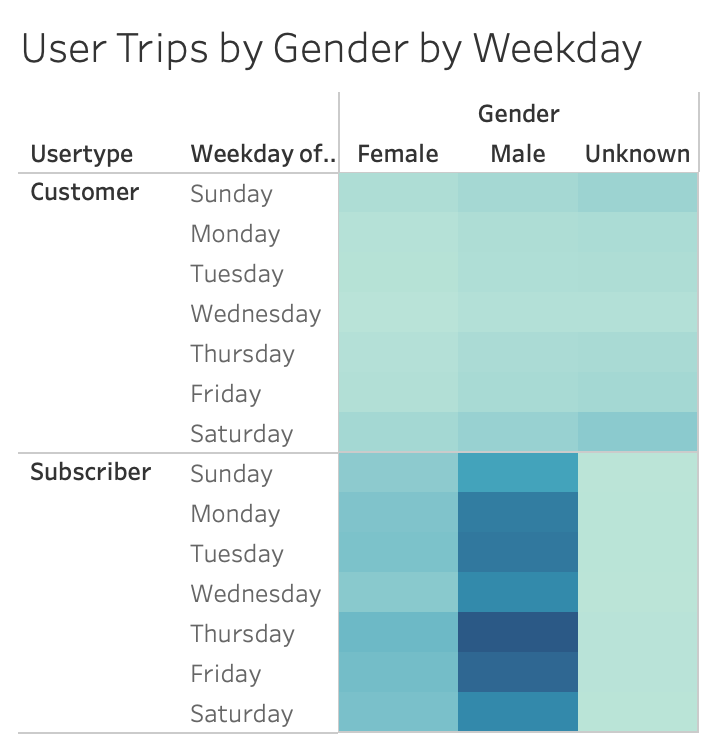
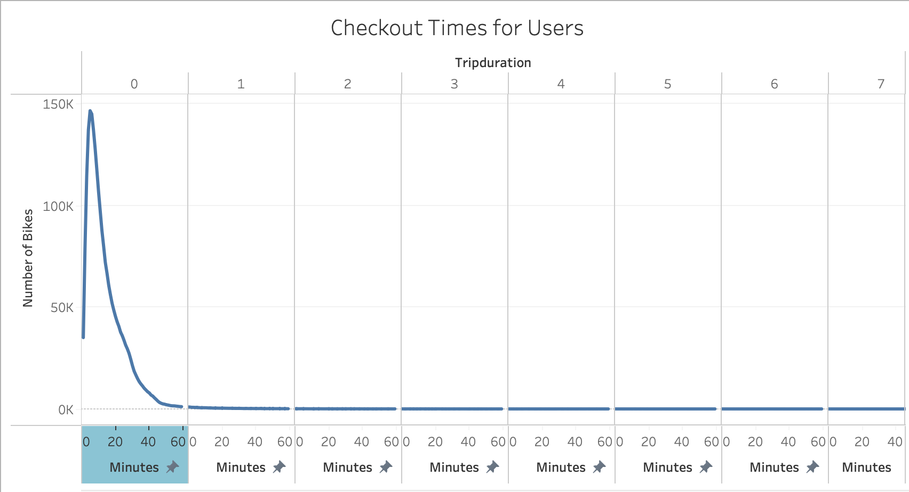
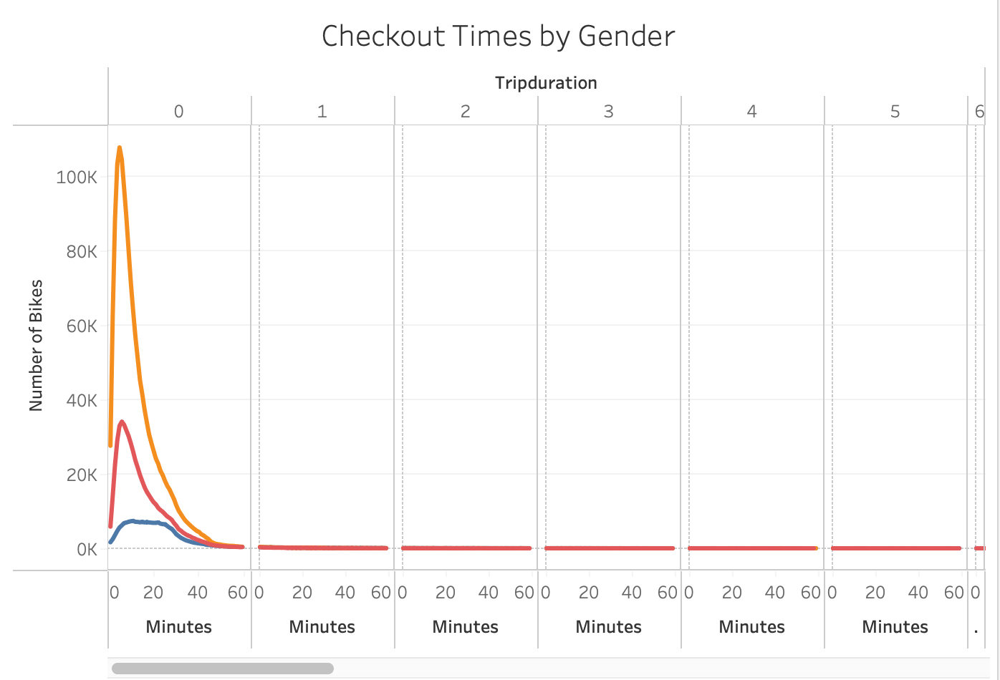
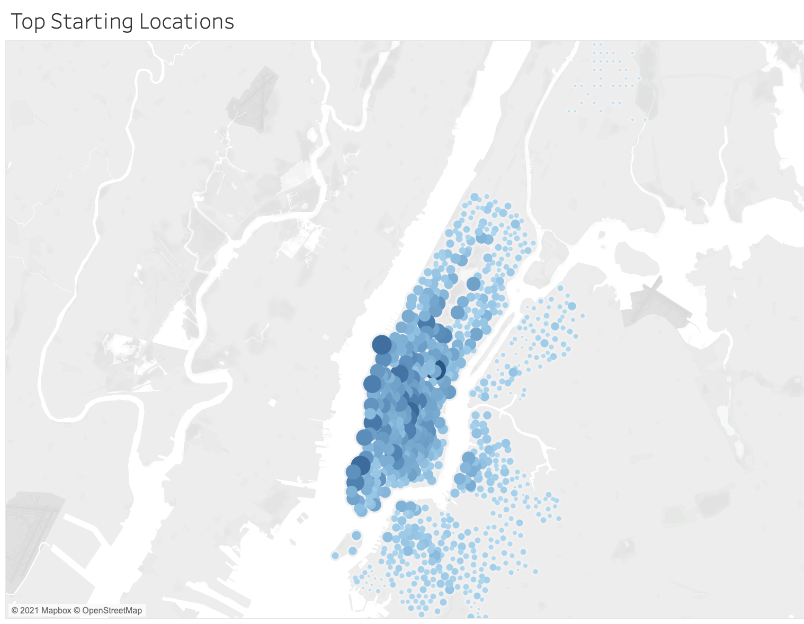
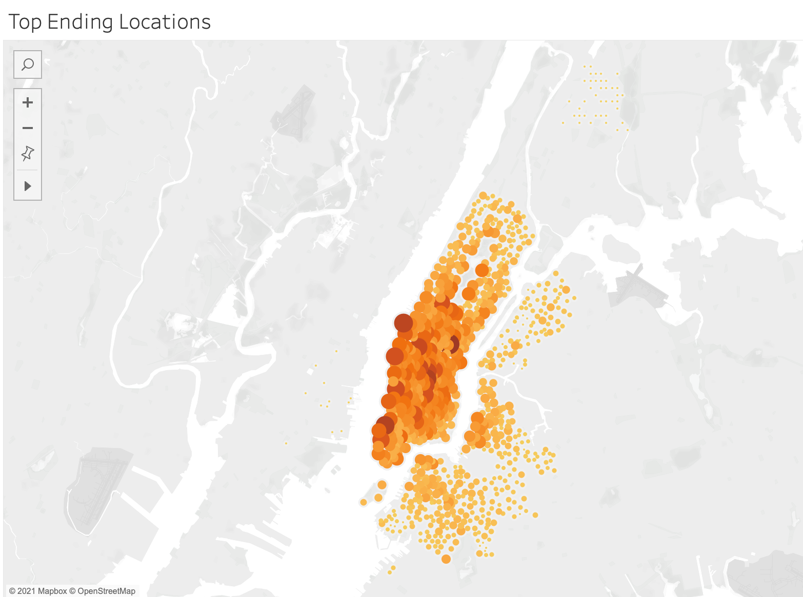

# NYC Citibike Analysis

Biking allows residents to easily get around large cities as well as being a benifit to tourists.    CitiBike is a biking rental company that services both residents and tourists within larget cities.    Citibike is currently operating in New York City.   The purpose of this analysis is to review the current data for Citibike operations to see if this model would be profitable in Des Moines as well.   

To view the full Tableau Story:
[link to dashboard](https://public.tableau.com/views/Module14Challenge_16215468230980/Citibike?:language=en&:display_count=y&publish=yes&:origin=viz_share_link)

## Overview
 [TripsperWeekdaybyGender.png](images/TripsperWeekdaybyGender.png)
 [TripsperWeekdayperHour.png](images/TripsperWeekdayperHour.png)
 [UserbyWeekdaybyGender.png](images/UserbyWeekdaybyGender.png)

## Checkout Times
 [CheckoutTimesforUsers.png](images/CheckoutTimesforUsers.png) [CheckoutTimesbyGender.png](images/CheckoutTimesbyGender.png)

## Popular Locations
 [TopStartingLocations.png](images/TopStartingLocations.png)
 [TopEndingLocations.png](images/TopEndingLocations.png)

